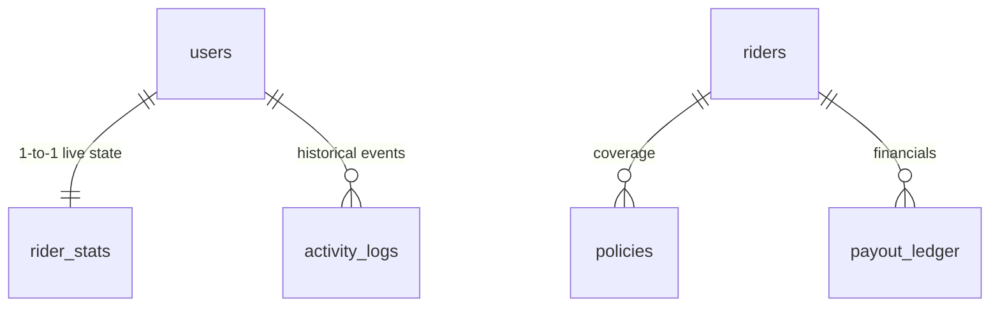

# GigShield — Database Schemas

> **Database:** PostgreSQL 15 · **Extensions:** `postgis`, `pgvector`, `uuid-ossp`
> **Source of truth:** `GigShield/apps/server/database/models.py`

---

## 🔒 Identity & User Core

### Table: `users`
Acts as the central identity for all riders, supporting the 14-day incubation period.

| Column | Type | Constraints |
|---|---|---|
| `id` | `UUID` | Primary Key, default `uuid_generate_v4()` |
| `name` | `VARCHAR` | NOT NULL |
| `phone` | `VARCHAR(20)` | UNIQUE, NOT NULL |
| `email` | `VARCHAR(255)` | UNIQUE, NOT NULL |
| `joined_at` | `TIMESTAMPTZ` | Default `NOW()` |
| `vehicle_type` | `VARCHAR(50)` | Nullable (e.g., 'ELECTRIC', 'PETROL') |

### Table: `rider_stats`
Live state tracking for active riders. Maintains a 1-to-1 relationship with `users`.

| Column | Type | Constraints |
|---|---|---|
| `user_id` | `UUID` | Primary Key, FK → `users.id`, UNIQUE |
| `trust_score` | `INTEGER` | Default `85` |
| `current_premium` | `FLOAT` | Default `60.0` |
| `total_payouts` | `FLOAT` | Default `0.0` |

---

## 📜 History & Auditing

### Table: `activity_logs`
Historical event log for system triggers and rider actions.

| Column | Type | Constraints |
|---|---|---|
| `id` | `UUID` | Primary Key, default `uuid4()` |
| `user_id` | `UUID` | NOT NULL, FK → `users.id` |
| `event_type` | `VARCHAR(100)` | NOT NULL (e.g., 'HAZARD_ENTRY', 'PAYOUT_TRIGGERED') |
| `h3_index` | `VARCHAR(15)` | Nullable (Spatial reference) |
| `amount` | `FLOAT` | Default `0.0` (For payments/payouts) |
| `timestamp` | `TIMESTAMP` | Default `NOW()` |

**Optimization:** Indexed on `(user_id, timestamp)` for fast historical retrieval.

---

## ⚡ Legacy / Simulation Core

### Table: `riders` (Legacy/Mock)
Used primarily for live simulator visualization.

| Column | Type | Constraints |
|---|---|---|
| `id` | `UUID` | Primary Key, default `uuid4()` |
| `name` | `VARCHAR` | NOT NULL |
| `age` | `INTEGER` | NOT NULL |
| `zomato_id` | `VARCHAR(50)` | UNIQUE, Indexed |
| `vehicle_type` | `ENUM` | `EV`, `PETROL` |
| `trust_score` | `INTEGER` | Default `80` |
| `primary_h3_zone` | `VARCHAR(20)` | Nullable, Indexed |

---

## 🏥 Hazards & Insurance

### Table: `hazard_events`
Active spatial hazards impacting the ecosystem.

| Column | Type | Constraints |
|---|---|---|
| `id` | `UUID` | Primary Key |
| `hazard_type` | `VARCHAR(50)` | NOT NULL |
| `hex_index` | `TEXT` | NOT NULL (Comma-separated H3 list) |
| `confidence_score`| `NUMERIC(5,2)`| Default `100.00` |
| `severity` | `INTEGER` | Default `8` (Range 1-10) |
| `is_active` | `BOOLEAN` | Default `FALSE` |
| `created_at` | `TIMESTAMP` | Default `utcnow` |

---

## 🔗 Relationships Summary

---

## 🛠️ Enums

| Enum | Values |
|---|---|
| `VehicleType` | `EV`, `PETROL` |
| `PolicyStatus` | `ACTIVE`, `INCUBATING` |
| `PayoutStatus` | `PENDING`, `SUCCESS` |
