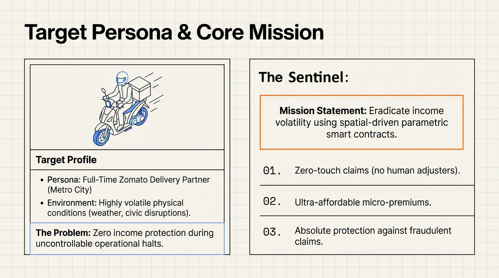
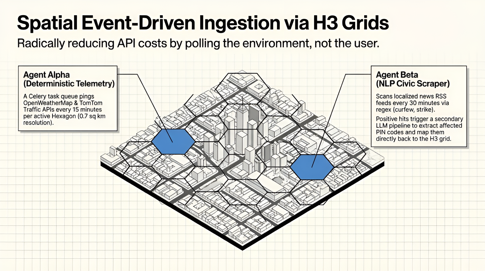
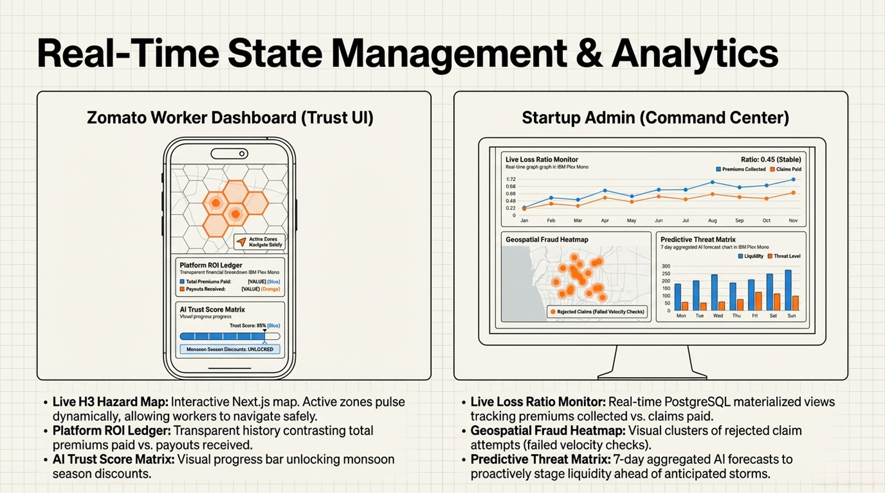

# GigShield: Algorithmic Income Resilience

**Target Persona:** Full-Time Zomato Delivery Partner (Metro City Operations)

**Core Mission:** Eradicate income volatility for gig workers due to external disruptions using zero-touch, spatial-driven parametric smart contracts.

> ### 🎥 **Project Overview Video**
> **[Click here to watch the full video on Google Drive ↗](https://drive.google.com/file/d/14z7swQW1qNsChvvBOLM9CLgNS2LtsPWG/view?usp=sharing)**

)

<!--  -->

---

## 1. Persona Strategy & Optimized Onboarding

To achieve hyper-growth and maintain highly profitable unit economics, our platform eliminates onboarding friction and third-party authentication costs. We integrate directly into the delivery partner's existing ecosystem.

### 1.1 Simulated OAuth 2.0 Authentication (Zero-Cost Auth)
We explicitly reject expensive third-party identity providers. Gig workers already possess verified identities on their parent platforms.
* **The Flow:** The mobile-first Next.js frontend features a frictionless **"Connect Zomato Partner Account"** gateway. 
* **The Protocol:** We simulate an OAuth 2.0 flow. The worker authenticates via their registered mobile OTP, granting our application read-only scopes for their profile and delivery history.

### 1.2 Automated Actuarial Data Ingestion
Upon authentication, our FastAPI backend instantly fetches the verified payload from the simulated Zomato Partner API. This provisions the AI models with rich, tamper-proof historical data:
* `rider_id`: Unique database identifier.
* `primary_h3_zones`: An array of the top H3 Hexagon IDs where the rider operates 80% of the time, establishing their baseline spatial risk.
* `vehicle_class`: Classifies the worker's asset (e.g., `EV_YULU` vs. `PETROL_BIKE`). This is critical for the AI baseline pricing, as EV riders carry a ~₹20/day operating cost versus ~₹250/day for ICE riders.
* `30_day_delivery_avg`: Used to calculate the worker's **Parametric Consistency Multiplier**, ensuring high-volume workers receive proportionally higher payouts during a disruption.

### 1.3 The Weekly Financial Mandate (Hackathon Constraint Compliance)
To strictly adhere to the mandatory Weekly Pricing model without causing massive user churn due to manual payment friction, the onboarding concludes with an automated financial gateway.
* **UPI AutoPay Integration:** The worker authorizes a recurring weekly mandate via a simulated Payment Gateway (e.g., Razorpay e-NACH/UPI Simulator) with a dynamic upper cap.
* **Strategic Synchronization:** Our backend cron job executes the AutoPay deduction strictly on **Thursday mornings at 10:00 AM**. Because Zomato processes weekly rider payouts on Wednesday nights, this precise timing guarantees the worker's bank account has peak liquidity, reducing failed transaction rates to near zero.

### 1.4 System Resiliency & Edge Cases
* **API Fallbacks:** If the simulated Zomato API times out, the UI gracefully downgrades to a manual declaration form. The account is flagged as `status: pending_verification`, and claims are capped at 50% until the automated sync succeeds.
* **Offline Capabilities:** Recognizing that delivery partners operate in volatile 4G/5G environments, the Next.js onboarding flow is built as a Progressive Web App (PWA). Core UI shells are cached via service workers to ensure the app loads instantly, even in low-bandwidth scenarios.

### 🛠 Core Tech Stack
* **Frontend Dashboard:** Next.js (PWA optimized)
* **Backend Engine:** FastAPI (Python) for asynchronous API ingestion
* **Geospatial Engine:** PostGIS & Uber’s H3 Hexagonal Hierarchical Spatial Index
* **Task Queues & Caching:** Celery & Redis (Velocity checks & API rate limiting)
* **Database:** PostgreSQL (Immutable financial ledger)

---

## 2. Dynamic Risk Profiling & AI Architecture

To maintain a sustainable liquidity pool while offering gig workers ultra-affordable premiums, our platform deploys a highly optimized, two-tiered Machine Learning architecture. It dynamically predicts spatial hazards and profiles individual risk while ruthlessly defending the startup against adverse selection.

### 2.1 The Dual-Engine AI Pipeline (OpEx Optimized)
Real-time LLM inference for every user would instantly bankrupt our DEVTrails operating budget. Instead, our **FastAPI** backend utilizes a batched, two-engine approach running on scheduled cron jobs to keep cloud compute OpEx strictly under ₹162/user/year.

* **Engine 1: Historical Baseline Profiler (Deterministic ML):** Powered by Scikit-learn/XGBoost, this engine analyzes the static data ingested during onboarding. It mathematically evaluates the worker's **Vehicle Class** (providing heavy discounts for low-OpEx EVs) and cross-references their primary **H3 Hexagon Topography** against databases of low-lying flood-prone terrain.
* **Engine 2: Predictive Hazard Engine (Time-Series Forecasting):** Ingests 7-day forecast telemetry (OpenWeatherMap) and historical civic disruption data per H3 Hexagon. Executing exactly once per week (Fridays at 4:00 PM), it calculates the precise percentage probability of a Tier Orange or Tier Red event occurring in that specific micro-zone.

### 2.2 The Dynamic Pricing Algorithm
Our proprietary algorithm does not guess; it calculates mathematical exposure and passes the exact risk cost to the user within highly affordable guardrails. 

Executed every Friday at 4:00 PM:
> **Premium = Base_Floor(₹50) + (Hazard_Probability × Expected_Liability × Risk_Modifier)**

**Formula Variables:**
* `Base_Floor`: Fixed at ₹50. The non-negotiable minimum to maintain startup operational liquidity.
* `Hazard_Probability`: The percentage output from Engine 2 (e.g., 60% chance of a localized flood in their zone).
* `Expected_Liability`: The maximum potential daily payout liability for the startup (e.g., ₹800/shift).
* `Risk_Modifier`: The fractional output from Engine 1 (e.g., `0.8` for low-overhead EV riders, `1.2` for ICE riders).

* **Financial Guardrails:** To ensure gig worker adoption, the final weekly premium is subjected to a strict floor-and-ceiling cap. It will never drop below **₹60** and will never exceed **₹115** (~1.5% to 2.5% of their weekly income).

### 2.3 Defeating Adverse Selection (Behavioral Economics)
If riders only purchase policies when a 90% chance of flooding is predicted, the startup's liquidity pool will collapse. Our Smart Contract enforces strict behavioral safeguards:
* **The 14-Day Incubation Protocol:** Upon registration, the account enters `status: incubating`. Premium collection initiates immediately, but claim payouts are cryptographically locked for the first 14 days, entirely neutralizing "storm-chasing" behavior.
* **AI Trust Score (Seasonal Loyalty Lock):** Worker loyalty is aggressively rewarded. If a worker maintains continuous subscription through the low-risk winter months, their `trust_score` scales to 99. Conversely, when the highly volatile monsoon season hits, the AI utilizes this Trust Score to heavily subsidize their dynamic premium cap.
* **Anti-Zone Spoofing:** To prevent users from declaring a safe zone but operating in a flood zone for a cheaper premium, our backend runs a Sunday night spatial reconciliation. If >30% of their weekly GPS pings fall outside their declared H3 Hexagon, they are automatically flagged `status: zone_mismatch` and their risk modifier is forcefully penalized.

### 2.4 Streamlined Pricing Experience
To build absolute trust and avoid overwhelming a demographic historically skeptical of complex financial products, the Next.js Worker Dashboard streamlines the UI by simply displaying the finalized AI-calculated cost for the upcoming week:  
**"Total Weekly Premium: ₹85"**  
Coupled with a **48-Hour Opt-Out Window** (Friday 5PM to Sunday Midnight), workers have complete agency over their weekly premium before the AutoPay mandate locks in.

---

## 3. Parametric Smart Contracts & Trigger Engines

Our core philosophy dictates that a claim should never rely on human intervention, adjusters, or subjective evaluation. The platform uses a spatial, objective rule-engine to trigger "Loss of Income" events instantly.

### 3.1 The 7-Day Smart Contract Lifecycle
To comply with the DEVTrails weekly pricing mandate, our policy engine operates on a strict 168-hour chronometer synced to gig-worker liquidity cycles:
* **The Friday Lock-In (T-Minus 48 Hours):** At 5:00 PM, the AI finalizes the upcoming week's dynamic premium and pushes the UI receipt to the worker.
* **The Monday Activation:** At 00:01 AM, coverage officially enters `status: active`. The worker is now protected against external disruptions.
* **The Thursday Settlement:** At 10:00 AM (post-Zomato Wednesday payouts), the Razorpay UPI mandate executes. If the deduction fails due to insufficient funds, the policy does not cancel; it enters a mathematical `grace_period` through Sunday, where any potential parametric payout is simply debited for the unpaid premium first.

### 3.2 Spatial Event-Driven Ingestion (The H3 Grid)
Polling external APIs for every single user would instantly burn our runway. Instead, our backend monitors the city via an **H3 Hexagonal Grid (Resolution 8)**—areas of roughly 0.7 sq km each—powered by a Celery Task Queue:
* **Agent Alpha (Deterministic Telemetry):** Pings OpenWeatherMap & TomTom Traffic APIs once every 15 minutes *per active Hexagon*.
* **Agent Beta (NLP Civic Scraper):** Scans localized news RSS feeds every 30 minutes using regex keywords (`curfew`, `strike`, `internet shutdown`). Hits trigger a secondary LLM pipeline to extract the affected PIN codes and map them to our H3 Hexagons.

### 3.3 The Parametric Trigger Matrix (The "If")
When ingested data crosses severe thresholds, the backend upgrades an H3 Hexagon's status. Triggers are completely divorced from vehicle repair or health coverage:
* **Tier Orange (50% Baseline Payout): Severe Urban Waterlogging.** 
  * *Condition:* Agent Alpha reports Rainfall > 50mm/hr **AND** average traffic speed drops below 10km/h for two consecutive 15-minute polling cycles. *(This protects against storms that pass quickly without halting logistics).*
* **Tier Red (100% Baseline Payout): Absolute Labor Halt.** 
  * *Condition 1 (Heatwave):* Sustained temperatures > 45°C between 12:00 PM and 4:00 PM.
  * *Condition 2 (Civic Disruption):* Agent Beta NLP sweep confirms a Section 144 Curfew or localized strike.
  * *Condition 3 (Platform Halt):* Simulated Zomato API returns `zone_status: offline`.

### 3.4 The Consistency Multiplier (The "Then")
A flat payout destroys startup unit economics and unfairly indemnifies casual workers the same as full-time hustlers. When an H3 Hexagon enters a Disruption State, the final payout is subjected to a mathematical multiplier based on the rider's historical effort:
> **Final Payout = Base_Tier_Value × (Worker's_30_Day_Avg_Deliveries / City_Avg_Deliveries)**

*(Example: A baseline Tier Red payout is ₹800. A full-time rider pulling 25 deliveries/day gets a 1.25x multiplier [₹1,000]. A part-time rider pulling 10 deliveries gets a 0.5x multiplier [₹400].)*

### 3.5 System Guardrails & Edge Cases
* **Conflicting Data Sources:** If Agent Alpha reports heavy rain, but the simulated Zomato Partner API returns `zone_status: online` and active order fulfillment is logged, Zomato API acts as the ultimate source of truth. If the worker is still earning, there is no "Loss of Income," and the parametric claim is aborted.
* **Post-Disruption Claim Lag:** Disruption States have a strict Time-To-Live (TTL) inside our Redis Cache. Once the 15-minute polling verifies weather/traffic has normalized, the Hexagon returns to `status: safe`. Only active workers pinged *during* the active TTL window are queued for automated payout.

---
## 4. Anti-Fraud Validation & Military-Grade Spatial Security

An automated payout system is a magnet for organized spoofing and bad actors. To ensure absolute platform viability and protect our liquidity pool from fraudulent drainage, we have implemented cryptographically secure spatial verification.

### 4.1 PostGIS Spatial Intersection Engine
To claim a payout, a worker cannot simply declare their primary zone was flooded. They must mathematically prove physical presence within the active danger zone to prevent abuse:
* **The Telemetry Cache:** The Next.js PWA transmits lightweight GPS coordinate pings to our FastAPI backend while a rider is 'On Duty'. To prevent massive PostgreSQL deadlocks, these ephemeral pings reside in a high-speed Redis cache with a strict 30-minute Time-To-Live (TTL).
* **The Intersection Query:** When Agent Alpha triggers a Red/Orange State, a highly optimized PostGIS script executes: *"Which active `rider_id`s have registered a GPS ping falling exactly inside this H3 Hexagon boundary within the last 15 minutes?"* Only geometrically verified riders are transitioned into the payout pipeline.
* **Navigational Intent Sync:** If a worker's ping shows them stalled aggressively on the *border* of a flooded Hexagon (e.g., unable to cross a flooded bridge), the system acts empathetically. It queries Zomato’s simulated `current_order_status` API. If their active delivery destination resides *inside* the flooded zone, physical intent is proven, and the parametric claim executes despite failing the intersection query.

### 4.2 Defeating GPS Spoofing via Velocity Checks
Location-mocking applications are the biggest threat to parametric insurance. Our Redis cache proactively thwarts this via **Velocity Calculation Checksum**. 
By evaluating the geospatial distance and timestamp sequence of a rider's last three GPS pings, the backend calculates their true travel speed. If a rider mathematically "teleports" from Zone A to Zone B (15km apart) in 4 seconds to falsely claim a flood payout, they exceed the speed of sound. The spatial engine instantly flags the claim as fraudulent, permanently shifts the account to `status: suspended`, and alerts the startup fraud division.

---

## 5. Zero-Touch Payout Processing Channels

The value of gig-worker insurance lies in instantaneous relief. Our payout channels remove all human adjusters, processing settlements in milliseconds while ensuring transaction integrity.

### 5.1 The Celery Execution Queue
Approved `rider_id`s demand instant financial relief, but mass-casualty weather events cause massive API bottlenecks. Approved claims are pushed into a highly asynchronous **Celery Task Queue**. A dedicated Python worker microservice consumes this queue, pacing the server-to-server API calls to prevent rate-limiting.

### 5.2 Simulated Payment Gateway Resiliency
The microservice routes the dynamically calculated funds (e.g., ₹800 × Consistency Multiplier) directly to the rider's integrated UPI ID via a simulated Payment Gateway (e.g., RazorpayX / UPI Payouts API).
* **Exponential Backoff:** If the Razorpay simulator returns an HTTP 503 Timeout during a massive regional flood, the queue initiates an Exponential Backoff strategy (retrying in 2, 4, then 8 minutes) to guarantee settlement without accidentally dropping or duplicating the financial payload.

### 5.3 The Immutable PostgreSQL Ledger
Upon receiving a `200 OK` success response from the payment gateway, the transaction is cemented into an immutable PostgreSQL ledger. This stringent database record includes:
* `incident_id`
* `rider_id`
* `raw_api_trigger_payload` (The exact weather/traffic JSON from Agent Alpha that caused the event)
* `payout_amount`
* `timestamp`

This creates a perfect audit trail, making ghost payouts or double-dipping mathematically impossible.

---

## 6. Real-Time Analytics Dashboards

Because parametric insurance relies entirely on abstract API data rather than physical damage, radical transparency is required to maintain user trust and ensure startup financial survival. 

To process live data injections without manual UI refreshes, our interface couples Next.js with localized state management and PostgreSQL materialized views, enabling hyper-fast aggregate metrics without crashing the database during mass-claim events.

### 6.1 The Zomato Worker Dashboard (Trust UI)
Delivery partners operate in a high-stress environment; their interface must establish trust instantly.
* **Live H3 Hazard Map:** The dashboard features an interactive map overlaying the city's H3 Hexagons. Safe zones remain transparent, while active Tier Orange or Tier Red disruption zones pulse dynamically. This allows workers to visually navigate away from unpayable danger areas.
* **Platform ROI Ledger:** A totally transparent history contrasting their total lifetime premiums paid versus the total parametric payouts received, quantifiably proving the platform's value.
* **AI Trust Score Matrix:** A visual progress bar detailing their continuous subscription streak, explicitly showing how many more weeks they need to maintain to unlock the discounted "Monsoon Season" premium caps.

### 6.2 The Startup Admin Dashboard (Command Center)
This dashboard is the startup's operational survival tool for the DEVTrails simulation, allowing founders to monitor financial health against the mandatory Phase burn rates.
* **Live Loss Ratio Monitor:** A real-time gauge comparing total premium revenue collected this week against the total claims paid out.
* **Geospatial Fraud Heatmap:** Visualizes rejected claim attempts. If a specific cluster of users in one H3 Hexagon consistently fails the GPS velocity checks, the admin can investigate organized spoofing rings.
* **Predictive Threat Matrix:** Anticipates Next Week's likely claim volume. By aggregating the AI Hazard Engine's 7-day forecasts, the admin can proactively stage liquidity ahead of a massive anticipated city-wide storm.

[Click here to watch the project video](https://drive.google.com/file/d/14z7swQW1qNsChvvBOLM9CLgNS2LtsPWG/view?usp=sharing)

---

> **© 2026 Krunal, Nipun, Aditya (Team MEGATRON). All Rights Reserved.**
> *This repository is submitted exclusively for the Guidewire DEVTrails 2026 Hackathon. Unauthorized copying, modification, or commercial use of this architecture, codebase, business logic, or any visual/media assets (including UI designs and linked project videos) by any outside party is strictly prohibited. See the `license.txt` file for details.*
